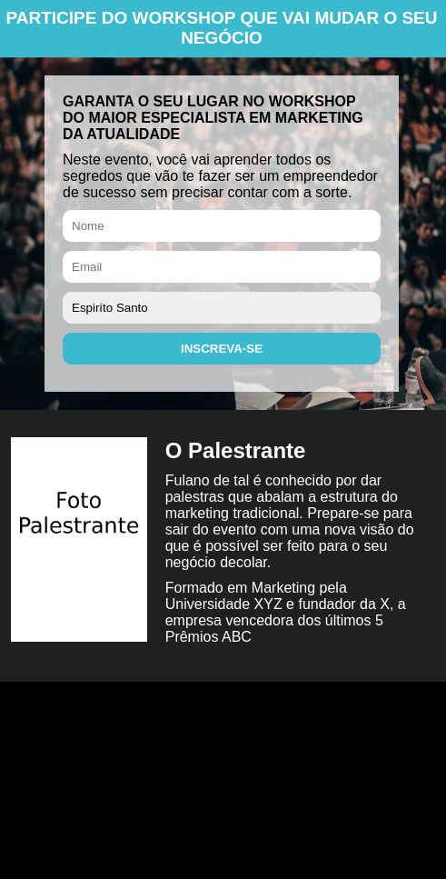
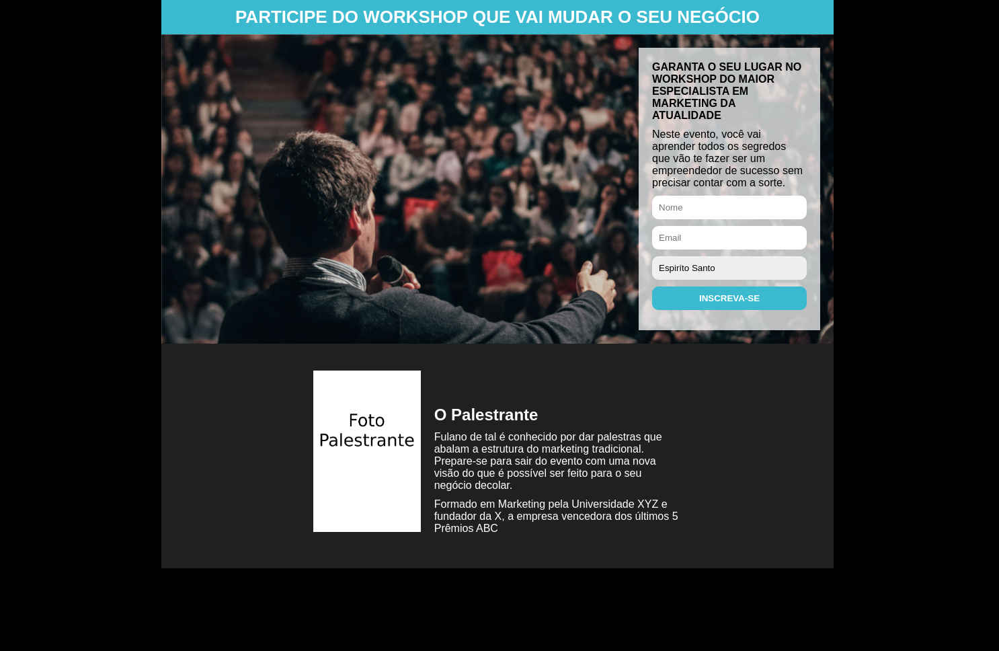

# Página de Captura
Essa atividade foi realizada no CURSO DESENVOLVIMENTO WEB FULL STACK - PROGRAMADOR BR, com o intuito de treinar os conhecimentos em HTML e CSS.

A página (formulário) funciona como base para um meio de comunicação em massa, onde a pessoa interessada faz seu cadastro para receber notificações sobre o palestrante fictício.

## Linguagens utilizadas e características 

1. HTML e CSS
2. Projeto Responsivo

## Página em execução

### 500 px

### 1500 px

